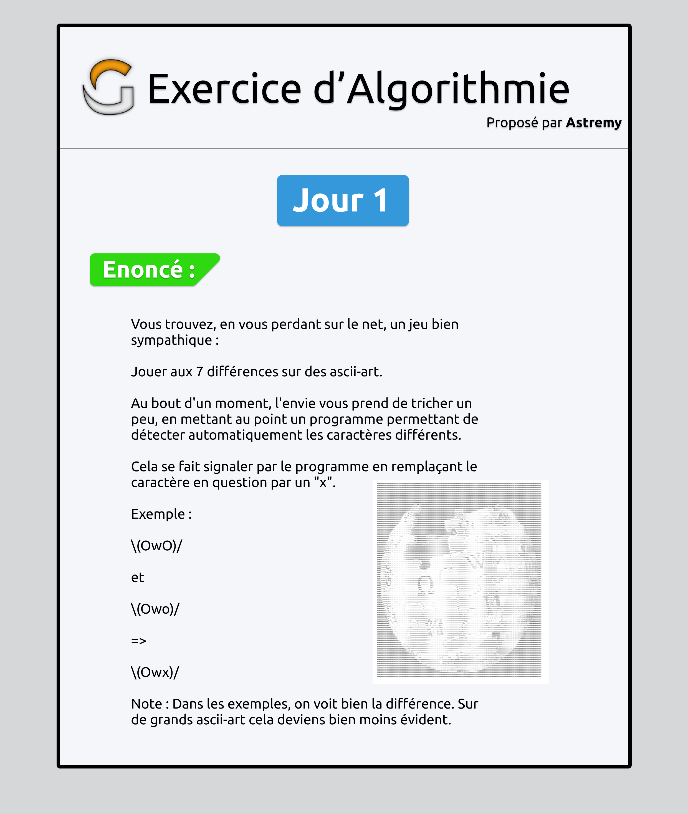

# Exo 1er Août 2020

## Consignes


## Set de tests (total : 4)

[Fichier original](../Tests%20Jour%201.txt)
### 1
```
\(OwO)/
```
et
```
\(Owo)/
```
=
```
\(Owx)/
```

---
### 2
```
 _[ ]_
\('o')/
 ( : )
```
et
```
 _[ ]_
/('-')\
|( : )|
```
= 
```
 _[ ]_
x('x')x
x( : )x
```

---
### 3
```
         (__)
         (oo)
  /-------\/
 / |     ||
*  ||----||
   ~~    ~~
```
et
```
         (__)
         (oo)
  ________\/
 / |     ||
*  ||----||
   ~~    ~~
```
=
```
         (__)
         (oo)
  xxxxxxxx\/
 / |     ||
*  ||----||
   ~~    ~~
```

---
### 4
```
hello
```
et
```
hello
```
=
```
hello
```
